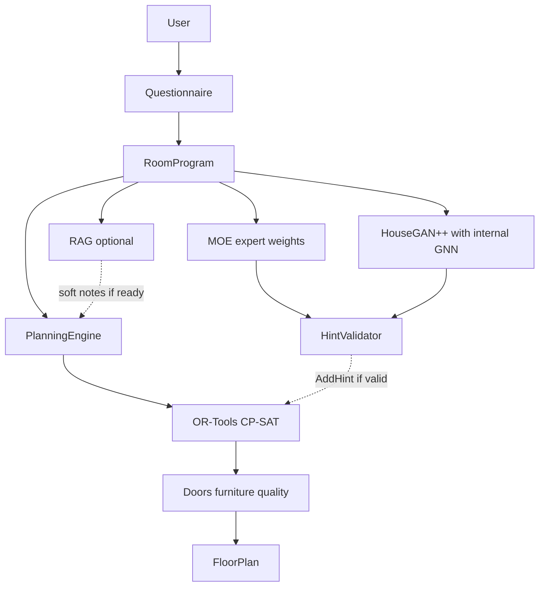

# KIYUB AI/ML ROOT-CAUSE AND INTEGRATION ANALYSIS

**Project:** `C:\Users\USER\Desktop\kiyub-buildify`  
**Date:** 20 September 2026  
**Scope:** Root-cause analysis and integration design. No generation, scoring, strategy-selection, FloorPlan schema, OR-Tools, planning-rule, or model-code changes. No downloads, no Ollama install, no env changes.

**Prior measurement:** [KIYUB_AI_ML_AUDIT.md](KIYUB_AI_ML_AUDIT.md) and `backend/audit_last_run.json`. This document explains **why** those failures happen and **where** each component should enter KIYUB later.

**Labels used below:**  
- **Confirmed** — source, git, HTTP, or a command run for this report.  
- **Hypothesis** — reasonable but untestable until a real HouseGAN checkpoint or live Space exists.

This is a conceptual design tool. Retrieved “code” text is not legal compliance. `irc_compliant` on refined FloorPlans stays false.

---

## 1. Executive Summary

**HouseGAN++ is broken** because three independent failures stack:

1. **Confirmed — missing local checkpoint.** Expected path `backend/moe/housegan/weights/housegan_pp.pt`. The `weights/` directory does not exist. Git never tracked that file (no LFS, no `.gitattributes`, `.gitignore` does not exclude `.pt`; MOE’s `buildify_moe.pt` *is* in the tree). There is no download script.
2. **Confirmed — remote Space does not exist.** `GET https://buildify-housegan.hf.space/`, `/health`, `/api/predict`, and `https://huggingface.co/spaces/buildify-housegan` all return **HTTP 404**. `render.yaml` still hardcodes that URL. Local Space source *does* implement `POST /api/predict`, so this is not “our FastAPI forgot the route”; the **hosted** Space is gone. The Space Dockerfile copies `app.py` only — even a fresh deploy would start **without** `housegan_pp.pt`.
3. **Confirmed — default KIYUB path would ignore a successful layout.** HouseGAN output is merged into the MOE plan, then `refine_generation` with `KIYUB_MULTI_STRATEGY=1` calls `compete()` and **never** `hints_from_moe_plan`. Audit A/B: empty MOE vs live MOE produced identical FloorPlan boxes.

The HouseGAN **PyTorch graph is executable**. An untrained `HouseGANGenerator().forward` on dummy tensors returned finite `(6, 1, 64, 64)` masks. That is **not** a trained layout. Do not call the architecture “broken” because weights are missing.

**RAG is not contributing** because of three independent gaps:

1. **Confirmed — embeddings require Ollama**, which was not running (`WinError 10061` on `localhost:11434`). No local fallback. `embed_cache.json` is gitignored and empty.
2. **Confirmed — `retrieve()` is never called** by `POST /api/generate/moe` or by `POST /api/chat`. Chat talks to `llama3.2` directly.
3. **Confirmed — knowledge is unstructured US IRC prose.** Even a working retrieve would return `list[str]`, not machine constraints. There is no adapter into RoomProgram, planning graph, or CP-SAT.

Cold startup spent **~98 s** retrying 39 sequential embeds (30 s timeout each, connection fail faster). That does not block generate after startup, but it couples FastAPI boot to a missing optional service.

**GNN is not part of KIYUB** because it is not a KIYUB service. `GraphConvLayer` / `GraphRelationNetwork` live **inside** `HouseGANGenerator` and emit graph features for **64×64 occupancy masks**. They do not predict KIYUB avoid-edges, circulation, or RoomProgram topology. They load only with `housegan_pp.pt`. Repairing HouseGAN would run the GNN as an internal encoder. Extracting it as a standalone relationship model would be a **new** model (out of scope).

**Correct later architecture (design only):** Questionnaire → RoomProgram → deterministic planning engine → optional RAG (soft text/heuristics) + optional MOE weights + optional HouseGAN/GNN candidate boxes → CP-SAT `AddHint` after validation → FloorPlan. OR-Tools remains the only producer of final geometry. Missing AI must fall through to today’s compete path.

---

## 2. HouseGAN++ Root Cause

### Intended contract (code)

```
constraints
  → build_bubble_diagram          (rooms + N×N adj + house W/H in feet)
  → HouseGANGenerator             (types, adj, noise z)
  → masks (N, 1, 64, 64)
  → masks_to_bboxes               (normalized 0–1 boxes)
  → scale_bboxes_to_feet          (min dims, clamp to W/H)
  → apply_us_conventions          (garage/foyer front, patio rear)
  → resolve_overlaps
  → _place_rooms_housegan         (keep HG x/y, MOE width/height)
  → moe["plans"]
  → [intended] hints_from_moe_plan → CP-SAT AddHint
  → [actual default] compete() ignores plans
```

Local vs remote: [backend/moe/housegan/inference.py](../backend/moe/housegan/inference.py) `generate_layouts(mode="auto")`: local `_get_local_model()` → else `_run_remote` → else `[]`.

### A. Missing infrastructure — **confirmed**

| Item | Evidence |
|---|---|
| Expected path | `WEIGHTS_DIR = Path(__file__).parent / "weights"`; file `housegan_pp.pt` |
| Directory | `backend/moe/housegan/weights/` **does not exist** |
| Git | `git ls-files backend/moe/housegan/` lists only `.py`. Commit `5a9a632` added the integration **without** a checkpoint |
| LFS | No `.gitattributes`; `git lfs ls-files` empty |
| gitignore | Does **not** ignore `*.pt` (`embed_cache.json` is ignored). MOE weights **are** committed. HouseGAN weights were never added, not “ignored” |
| Download script | None in README or `moe/housegan/` |
| Documented URL | Client + [render.yaml](../render.yaml): `https://buildify-housegan.hf.space/api/predict`. [hf_space/README.md](../backend/hf_space/README.md) documents the same path. No Hugging Face model-card URL for `housegan_pp.pt` |
| Space image | [hf_space/Dockerfile](../backend/hf_space/Dockerfile) `COPY app.py` only — **no checkpoint in the image** |

### B. Missing checkpoint — **confirmed**; compatibility — **hypothesis**

`load_pretrained` / Space `get_model` accept `ckpt["generator"]` or `ckpt["model_state_dict"]` or a raw state dict, `strict=False`. That is defensive. **Whether a future file would match `HouseGANGenerator` cannot be proven** until the file exists.

Comment in `apply_us_conventions`: “HouseGAN was trained on Chinese apartments (no garages…)”. `__init__.py` says RPLAN. **Hypothesis:** any recovered official HouseGAN++ RPLAN weights would **not** natively know garage/mudroom/patio as KIYUB uses them (`HG_TYPES` garage=14, mudroom=15 are labeled “extension”).

### C. Broken hosted endpoint — **confirmed**

| Probe (this report) | Result |
|---|---|
| `GET https://buildify-housegan.hf.space/` | 404 |
| `GET .../health` | 404 |
| `POST .../api/predict` (audit) | 404, HTML body |
| `GET https://huggingface.co/spaces/buildify-housegan` | 404 |

Local Space source [hf_space/app.py](../backend/hf_space/app.py):

- `GET /`, `GET /health`, `POST /api/predict`
- Body `{"data": [hg_type_vector, binary_adj, house_w, house_h, num_samples]}`
- Return `{"data": [layouts]}` where layouts are lists of `[x1,y1,x2,y2]`

Client `_run_remote` sends that exact payload and reads `data["data"][0]`. **Payload mismatch is not why today’s 404 happens** — the host never reaches the handler. **Hypothesis:** Space unpublished, renamed, or never deployed under that slug.

Correct later repair is a **combination**: restore or drop the remote URL; ship or load a local checkpoint; keep the existing request/response adapter if the Space app is what gets deployed. Do not assume Gradio `/api/predict` vs FastAPI is the live bug: **our** Space is FastAPI, and 404 is HTML from a missing host.

### D. Code bugs vs missing weights

| Question | Finding |
|---|---|
| Architecture complete? | **Yes enough to run.** Untrained forward: `NUM_ROOM_TYPES=18`, embedding size 19, 2,670,082 params, output `(N,1,64,64)`, finite, values ~0.49–0.53 |
| Inference constructs model? | `_get_local_model` → `load_pretrained` if file exists; else `None` |
| Preprocess match? | `room_types` long `(N,)`, `adj` float `(N,N)`. Live bubble max type id **14** `< 19` embeddings — **in range** |
| Postprocess match? | Masks → bbox 0–1 → feet using diagram `house_w/h` (not lot envelope) |
| Expected output | Occupancy **masks**, not coordinates, not adjacency prediction |
| Implementation “broken”? | **No crash path.** Empty list is intentional fallback. Untrained masks are **not** architecturally meaningful |

### E. Integration problems — **confirmed**

Even if inference returned rooms:

1. Bubble footprint this live request: **58.7 × 43.4 ft**, independent of the 20×30 m lot envelope (**55 × 88 ft** integer). Coordinate systems can disagree before CP-SAT.
2. `_place_rooms_housegan` keeps HG **position**, overwrites **size** with MOE.
3. Default `compete()` does not pass those boxes as `hints`. CP-SAT `AddHint` exists and is the right primitive (`solver.py` lines 149–155) but only on the `MULTI_STRATEGY=0` hybrid branch.

### Confirmed vs hypothesis

**Confirmed:** missing file and dir; never in git; Space 404 including Space page; Dockerfile has no weights; architecture forwards; type ids in range; default pipeline ignores geometry; three remote attempts ~0.9 s each (audit).

**Hypothesis:** recovered RPLAN weights vs `strict=False` US type ids 14–15; whether a redeployed Space without a `.pt` would produce useless sigmoid-0.5 masks (untrained run supports this).

---

## 3. HouseGAN++ Correct Integration Point

HouseGAN output is **axis-aligned boxes from masks**, after US post-process. It is a **learned spatial proposal**, not a constraint solver and not a relationship API.

Evaluated against KIYUB:

| Role | Fit |
|---|---|
| 1. Produce final geometry | **No.** Violates lot envelope, RoomProgram counts, garage frontage, avoid-edges. Default compete already overwrites it. |
| 2. Propose a candidate layout | **Yes.** That is what masks→bboxes are. |
| 3. Initialization / hints to CP-SAT | **Yes.** `AddHint(x,y,w,h)` already exists. Audit: `MULTI_STRATEGY=0` **did** change boxes. |
| 4. Predict relationships | **No.** Adjacency is **input** (`binary_adj`), not output. |
| 5. Predict room positions | **Yes**, as a prior, not as hard pins. |
| 6. Learned prior | **Yes** — same as 2+3. |

**Where it should enter (later, not now):**

```
Questionnaire
  → RoomProgram + envelope          (canonical room set; do not take HouseGAN’s room list as program)
  → Planning engine                 (zones, avoid, access, mass)  [unchanged]
  → build_bubble_diagram from the SAME program (adapter needed: today bubble is rebuilt from raw constraints and can diverge)
  → HouseGAN masks → boxes
  → validate: types 1:1 with program, boxes inside envelope
  → hints_from_* → solve / compete AddHint
  → OR-Tools + validator
  → FloorPlan
```

Today HouseGAN is called **inside** `predict_floor_plan` **before** RoomProgram. That is the wrong boundary: KIYUB’s canonical rooms are `from_constraints`, not the bubble list (MOE plan had a pantry; program did not).

Do **not** let HouseGAN skip OR-Tools. `apply_us_conventions` is a heuristic patch for RPLAN bias; KIYUB already encodes garage/patio in CP-SAT.

---

## 4. RAG Root Cause

### Embedding failure — **confirmed**

| Item | Value |
|---|---|
| Provider | Ollama HTTP, no API key |
| Embed URL | `http://localhost:11434/api/embeddings` |
| Tags probe | `http://localhost:11434/api/tags` — connection refused |
| Model | `nomic-embed-text:latest` |
| Timeout | 30 s per chunk |
| Chunks | 39 in `arch_knowledge.json` |
| Cache | `embed_cache.json`, gitignored, `{}` after failed init |
| Fallback | None. Failed chunk is printed and skipped. `_ready = True` anyway |
| Retrieve if empty cache | `return []` |

Ollama is **required for embeddings**, **optional for generate succeeding**. README “Running Locally” does **not** mention Ollama or `nomic-embed-text`. There is no preinstalled embed vector file in git.

### Startup coupling — **confirmed**

[backend/main.py](../backend/main.py) `startup_event`: `await rag.initialize()` then `load_model()`. Initialize loops **all missing chunks sequentially**. Audit: **98.1401 s** with Ollama down. Generate itself does not call RAG; TestClient HTTP 149 s included this boot tax.

### Missing retrieval call — **confirmed**

Callers of `retrieve`: `rag.py` definition, `audit_generation.py` probe.  
`main.py` generate: no import of retrieve.  
`/api/chat`: `POST localhost:11434/api/chat` model `llama3.2` with a static system prompt — **not** RAG.

Intent conflict:

- `rag.py` module docstring: “improve floor plan generation”
- README tree: “RAG-based AI design chat”
- Neither path is wired

### Knowledge-to-planning gap — **confirmed**

`retrieve` returns `list[str]` (raw `chunk["text"]`). Chunks also have `id` and `category`, which retrieve **drops**. Nothing maps text → RoomSpec, topology edge, or CP-SAT constraint. Retrieved information **cannot** affect FloorPlan in the current code, even if Ollama were up.

---

## 5. RAG Correct Integration Point

RAG should **not** generate geometry. The knowledge base is narrative US practice, not a solver.

**Reasonable later role:** optional architectural **context** for (a) chat explanations, (b) soft planning notes (preferred sizes, adjacency language) **after** RoomProgram exists, **never** as hard code.

```
Questionnaire → RoomProgram
                  ↓
            RAG retrieve(query from program: rooms, garage, patio, style)
                  ↓
            [future adapter] structured hints OR chat context
                  ↓
            Planning engine hard rules remain source of truth
                  ↓
            OR-Tools
```

Interaction with existing layers:

| Layer | RAG may | RAG must not |
|---|---|---|
| Architectural Program | Suggest preferred sizes already in text (e.g. living 14×18) as **soft** prefs | Add/drop rooms, change bedroom count |
| Planning / zoning | Echo “bedroom wing / garage front” already implemented | Override Philippine profile or avoid-edges |
| Relationship graph | Text like “kitchen adjacent to dining” already hard in topology | Invent new hard links from prose |
| OR-Tools | No direct input | No retrieved string as constraint |
| Chat | Natural fit for current KB | Claim IRC/Philippine legal compliance |

Do not treat US IRC snippets as Philippine building-code values.

---

## 6. GNN Root Cause

| Question | Answer |
|---|---|
| Architecture | 3-layer `GraphConvLayer` (degree-normalized neighbor aggregate + Linear + LayerNorm + ReLU), stacked as `GraphRelationNetwork`. Duplicate in `hf_space/app.py`. |
| Predicts | **Not** edges. Node features for mask decoders. `forward(room_types, adj) → masks (N,1,64,64)`. |
| Inputs | Noise `z` (N,128), type embedding (64), adj (N,N). Refine pass concatenates mask stats (cx,cy,sx,sy). |
| Outputs | Occupancy masks (via decoder), not KIYUB `SemanticRelation`. |
| Training objective | **Not in this repo.** Inference-only. Paper-level GAN layout objective is **hypothesis**. |
| Weights | Same `housegan_pp.pt` — **missing** |
| Trained / loaded / called / used | No / no / no / no on this machine |
| Coupled to HouseGAN | **Yes.** `grn_init` / `grn_refine` are attributes of `HouseGANGenerator`. |
| Independent? | **No** without a new checkpoint and head. |
| KIYUB graph match? | See §7. Same “rooms + adjacency” metaphor, **different semantics** (must-touch GAN input vs required/preferred/avoid + circulation). |
| Vocabulary | `HG_TYPES` 1–15 vs RoomProgram types; ensuite/closet/patio collapsed. |
| Geometry vs relationships | **Geometry masks**, using relationships as **input**. |

**Classification for later work:** **A — usable as-is once HouseGAN is repaired** (GNN runs inside the generator). Also **D — tied too tightly to HouseGAN** to serve as KIYUB’s planning graph. Not a separate generator.

**GNN is not currently part of the active generation pipeline.** Do not build a replacement GNN.

---

## 7. Graph Compatibility

### Conceptual difference

| | KIYUB | HouseGAN / GNN |
|---|---|---|
| Node | `RoomSpec` / `ProgramSpace` (`p0`, `p1`, …) | `BubbleRoom` (`living`, `bed1`, …) |
| Edge | Typed: `connected`, `accessed_by`, `near`, `outside_access`, **`avoid`**; strength required/preferred/avoid | Scalar 0–1 “must be adjacent”; `binary_adj` threshold 0.4; **no avoid** |
| Circulation | Explicit hallway graph + reachability scoring | Hallway is just another node |
| Zones | public / private / service / outdoor in planner | bubble `zone` used in post-process, not in GNN |
| Geometry | CP-SAT integers in **lot envelope (ft)** | 64×64 mask then scale to **bubble W×H** |
| Avoid garage–bedroom | Planning graph | Not represented; US post-process pushes bedrooms back |

They are **not the same graph**. An adapter can map **required/preferred “touch” edges → 1.0/0.5** and **omit avoid** (or leave them to CP-SAT). Feeding KIYUB avoid-edges into HouseGAN adj would be meaningless.

### Type mapping (live 20×30, office yes, 15 bubble rooms)

| KIYUB / RoomProgram type | HouseGAN `HG_TYPES` id | Compatible? | Adapter needed? |
|---|---|---|---|
| living_room | 1 living_room | Yes | No |
| master_bedroom | 2 master_bedroom | Yes | No |
| kitchen | 3 kitchen | Yes | No |
| bathroom | 4 bathroom | Yes | No |
| ensuite_bathroom | 4 bathroom | Collapsed | Yes — two KIYUB types, one HG class |
| half_bath | 4 bathroom | Collapsed | Yes |
| dining_room | 5 dining_room | Yes | No |
| bedroom | 6 bedroom | Yes | No |
| home_office | 7 home_office (comment: study) | Extension vs original RPLAN | **Hypothesis** if using paper weights |
| foyer | 10 foyer | Yes (RPLAN entrance) | Verify against real ckpt |
| walk_in_closet | 11 closet | Collapsed | Yes |
| closet | 11 closet | Yes | No |
| laundry_room | 12 laundry_room | Extension | Hypothesis |
| hallway | 13 hallway | Yes | No |
| garage | 14 garage | **US extension; code says RPLAN has no garage** | Yes — post-process already forces front |
| mudroom | 15 mudroom | Extension; KIYUB does not auto-add | Yes if present |
| patio / deck | 9 balcony | Collapsed outdoor | Yes |
| pantry / family_room / great_room | living or omitted | Program vs bubble can diverge | Must build bubble **from RoomProgram** |
| Node features | type, zone, min/pref size, access | type id + noise + mask stats | Adapter |
| Edge features | kind + strength | binary/float adj | Adapter; drop `avoid` |
| Room IDs | `p0`… | `living`, `bed1` | Map by type order (existing `hints_from_moe_plan` pattern) |
| Normalization | integer feet in envelope | mask 0–1 then × bubble W/H | Scale into envelope; reject overflow |
| Coordinates | y=0 street / front | same convention after `apply_us_conventions` | Keep; still validate garage `y==0` or side |

`NUM_ROOM_TYPES = 18` but `HG_TYPES` max id is **15**. Ids 16–17 unused. Embedding table size 19 (padding 0). Live max id 14 — **no index error**.

---

## 8. Recommended KIYUB AI Architecture

Do **not** insert every model in a single mandatory chain. Audit showed generate already succeeds without them. Sequential “RAG then MOE then GNN then HouseGAN then planner then CP-SAT” would add latency and new failure modes without a contract into `AddHint`.

**Recommended: planner + solver always; AI optional and parallel.**



Rejected as default: HouseGAN as final geometry; GNN as topology oracle; RAG as constraint compiler; MOE plan list as RoomProgram.

OR-Tools and the planning engine stay the authority. AI may only **propose**.

---

## 9. Component Responsibilities

| Component | Responsibility | Input | Output | Consumer |
|---|---|---|---|---|
| RAG | Optional retrieval of US practice text; later: chat context or soft size/adjacency notes | Query from program; `arch_knowledge.json` | `list[str]` today; structured notes only after an adapter | Chat (intended); planner **soft** only; **not** CP-SAT |
| MOE | Learned expert mix for sizing/style prior; optional box list | 20-dim constraints | 8 weights + confidence; zone/HG-placed rooms | Payload metadata today; later `AddHint` sizes/positions; **not** room counts |
| GNN | Internal message passing for HouseGAN masks | Node noise+type, adj | Graph features → masks | `HouseGANGenerator` only |
| HouseGAN++ | Learned candidate footprints from bubble graph | Types + adj + W/H | `(N,1,64,64)` → boxes | Hint validator → CP-SAT; **not** FloorPlan |
| Planning engine | Deterministic program, site/access, zones, avoid, blocks, mass | RoomProgram | SpatialPlan, BuildingMass, topology | CP-SAT hard/soft terms |
| OR-Tools | Exact feasible geometry | Program, envelope, plan, optional hints | Layout | Validator → FloorPlan |

---

## 10. Fallback Architecture

The system must **never** fail generate because AI is down. Today’s compete path **is** that fallback.

| Condition | Behavior (design; already mostly true) |
|---|---|
| MOE unavailable / untrained | Empty `expert_weights`; RoomProgram + compete unchanged |
| HouseGAN unavailable / `[]` | `_place_rooms_architectural`; compete ignores MOE boxes anyway |
| GNN unavailable | Same as HouseGAN (same module) |
| RAG / Ollama unavailable | Skip retrieve; do not block startup (today **does** block ~98 s — later fix) |
| Checkpoint missing | Local skip; do not hammer a 404 Space (today **does** 3×) |
| Remote 404 | Treat as unavailable after first failure |
| AI output invalid (wrong count, outside envelope) | Drop hints; CP-SAT unconstrained by AI |
| AI conflicts with hard constraints | CP-SAT infeasible on hints → retry without hints (hybrid already retries `hints=None`) |

Rule: **AI available → use as hints. Unavailable → deterministic. Invalid → reject AI, keep solver.**

---

## 11. Performance Implications

Measured (audit, live 20×30, office yes):

| Stage | Time | After a later repair (estimate from code, not a new benchmark) |
|---|---|---|
| MOE load | 0.0564 s once | Cache already; keep |
| MOE gating | 0.002 s | Keep |
| HouseGAN local miss | 0.0001 s | Trained CPU forward: **unknown**; architecture is 2.7M params + 3 refine steps; **do not invent ms** |
| HouseGAN remote 404 ×3 | ~0.9 s × 3 inside predict 2.7134 s | **Avoid** after first 404; batch variants in one local forward loop if local ckpt exists (`_run_local` already loops `num_samples`) |
| RAG cold init | 98.1401 s | **Must not** run on startup when Ollama down; cache embeddings in-repo or lazy-init |
| RAG retrieve | 0.0006 s empty | One embed + cosine over 39 chunks if Ollama up — small vs CP-SAT |
| Planning / mass | 0.0003 / 0.0001 s | Unchanged |
| Quality sum | 0.2599 s | Unchanged |
| 5× CP-SAT compete | 48.4031 s | Unchanged in this design; hints may help or hurt search time — **unmeasured** |
| Warm generate | ~48–51 s | Dominated by CP-SAT unless compete is changed (out of scope) |

Cache: MOE already process-global; HouseGAN `_cached_model` exists; RAG cache file exists but empty and gitignored. GNN compute is **inside** HouseGAN forward — do not run a second GNN pass.

---

## 12. Integration Risks

**HouseGAN**

- Room vocabulary: garage/mudroom/balcony extensions vs RPLAN (**hypothesis** until ckpt).
- Bubble W×H ≠ lot envelope (confirmed 58.7×43.4 vs 55×88).
- Learned boxes violate hard garage frontage / avoid — CP-SAT must remain last.
- Checkpoint mismatch: `strict=False` can load **silently wrong** layers.
- Quality: untrained masks ~0.5 everywhere; a bad ckpt could look “successful” and still be noise.
- Comment: Chinese apartment training vs KIYUB houses.

**RAG**

- Prose is not geometry.
- US-centric; not Philippine; “IRC” text is not KIYUB legal compliance.
- Hallucinated adjacency if later piped into hard constraints.
- Startup coupling to Ollama.

**GNN**

- Not a topology predictor; using it as one would fight `planning_graph` avoid-edges.
- Same missing checkpoint.
- No independent training data in-repo.

**MOE**

- Weights echoed, geometry unused on default path (confirmed).
- Confidence 86.9 is not correctness.
- `_moe_adjusted_size` can disagree with RoomProgram preferred sizes.
- Extra rooms (pantry) vs program.

---

## 13. Implementation Roadmap

Only phases the investigation supports. **Do not implement here.**

**Phase A — HouseGAN infrastructure / checkpoint contract**  
Document required path `backend/moe/housegan/weights/housegan_pp.pt`, key names (`generator` / `model_state_dict`), and that remote Space is 404. Do not download in-tree until a known-good hash exists. Optional: stop calling a dead URL after one failure (behavior change — later).

**Phase B — Local inference proof**  
With a real checkpoint only: load, forward, bbox, compare room count to bubble. Fail closed to `[]`.

**Phase C — HouseGAN adapter into KIYUB**  
Build bubble **from RoomProgram**, scale boxes into **envelope**, map types 1:1, feed `AddHint`. Keep `compete()` as default until product decides hints+compete vs hybrid-only. Do not make HouseGAN the FloorPlan.

**Phase D — RAG non-blocking initialization**  
Lazy init or skip when `localhost:11434` is down; do not sequential-wait 39 embeds on FastAPI startup.

**Phase E — RAG → planning/chat guidance adapter**  
Call `retrieve` from chat first (matches README). If generation uses it, parse only **soft** notes; never hard CP-SAT from text. Do not rewrite `arch_knowledge.json` in the first slice.

**Phase F — GNN**  
**No separate GNN product phase.** It rides along with HouseGAN Phase B. Do **not** add an independent GNN.

**Phase G — AI candidate → OR-Tools validation**  
If hints make a solve infeasible, retry `hints=None` (hybrid already does). Log used vs rejected. Do not change scoring or strategy selection in that slice unless a later product task says so.

Not supported as a phase: new GNN, new LLM, replacing OR-Tools, treating RAG as code compliance, making HouseGAN final geometry.

---

## 14. Tests Required Before Implementation

**Phase A**

- Assert documented weights path; skip or xfail local load if file absent (do not fail CI for a missing optional ckpt).
- HTTP probe: remote 404 is **unavailable**, not a test failure of CP-SAT.

**Phase B** (only if checkpoint present)

- `load_pretrained` no exception; `forward` shape `(N,1,64,64)`; all finite.
- `generate_layouts` length ≥ 1; each layout length == bubble `n`.
- Type vector max `< type_embed.num_embeddings`.

**Phase C**

- Bubble room types **multiset-equal** RoomProgram types (no extra pantry).
- All hint boxes inside envelope.
- `compete` / `solve` still `status=valid` with hints dropped.
- With hints: requested bed/bath/garage/office/laundry/patio counts unchanged.
- Garage still street-front or side (existing planning tests).
- A/B: invalid HouseGAN (empty/`[]`) equals current baseline geometry.

**Phase D**

- App startup with Ollama down completes without ~98 s embed loop (timeout budget).
- Generate still HTTP 200.

**Phase E**

- `retrieve` not required for generate 200.
- Chat or planner receives strings only; no new hard topology edges from RAG.
- Empty cache ⇒ `[]`, generate valid.

**Phase G**

- Infeasible hints ⇒ fallback solve valid (existing hybrid pattern).
- `irc_compliant` remains false on refined payload.
- Solver tests: 111 passed baseline must remain the gate.

---

## Files inspected (this task)

- `docs/KIYUB_AI_ML_AUDIT.md`, `backend/audit_last_run.json`, `backend/audit_generation.py`
- `backend/moe/housegan/{model,inference,bubble_diagram,__init__}.py`
- `backend/moe/inference.py` `_place_rooms_housegan`
- `backend/hf_space/{app.py,README.md,Dockerfile}`
- `backend/rag.py`, `arch_knowledge.json`, `embed_cache.json`
- `backend/main.py`, `render.yaml`, `README.md`, `.gitignore`
- `backend/solver/{pipeline,solver,adapter,room_program,topology,planning_graph}.py`
- Git: `ls-files`, `log` on `backend/moe/housegan`, no LFS

## Commands (read-only / dry-run)

```
GET https://buildify-housegan.hf.space/          → 404
GET https://buildify-housegan.hf.space/health    → 404
GET https://huggingface.co/spaces/buildify-housegan → 404
git ls-files backend/moe/housegan/
python -c "HouseGANGenerator().forward(dummy)"  → shape (6,1,64,64), finite
build_bubble_diagram(LIVE) → 15 rooms, W=58.7 H=43.4, max type id 14
```

No pytest re-run required; prior **111 passed**. No generation behavior change.

---

## Concise answers

1. **What broke HouseGAN++?**  
   Local `housegan_pp.pt` was never in the repo; Hugging Face Space `buildify-housegan` is gone (404 on `/`, `/health`, `/api/predict`, and the Space page); the Space Docker image would not include weights anyway. The PyTorch graph still forwards untrained. Independently, default `compete()` would ignore a good layout.

2. **What prevents RAG from contributing?**  
   Ollama is down; cache empty; `retrieve()` is not called by generate or chat; chunks are US prose with no structured adapter into planning or CP-SAT.

3. **What prevents GNN from contributing?**  
   It is HouseGAN’s internal encoder, not a KIYUB topology model, and it has no weights. It does not appear on `POST /api/generate/moe` except as dead code inside the unloaded generator.

4. **Correct integration points?**  
   HouseGAN (+GNN): candidate boxes → envelope-checked `AddHint` **after** RoomProgram/planning, **before** CP-SAT. RAG: optional chat/soft notes, lazy init. MOE: weights + optional hints, not RoomProgram. OR-Tools: final geometry.

5. **Fix first?**  
   Checkpoint contract and stop depending on the dead Space; then non-blocking RAG startup; then a hints adapter that cannot override hard planning. Do not start with a new GNN.

6. **What must NOT be changed?**  
   OR-Tools as last authority; scoring and strategy selection; FloorPlan schema; planning hard rules / Philippine profile-as-compliance claims; deleting HouseGAN, RAG, or GNN code; replacing those models; installing services as a substitute for understanding.
